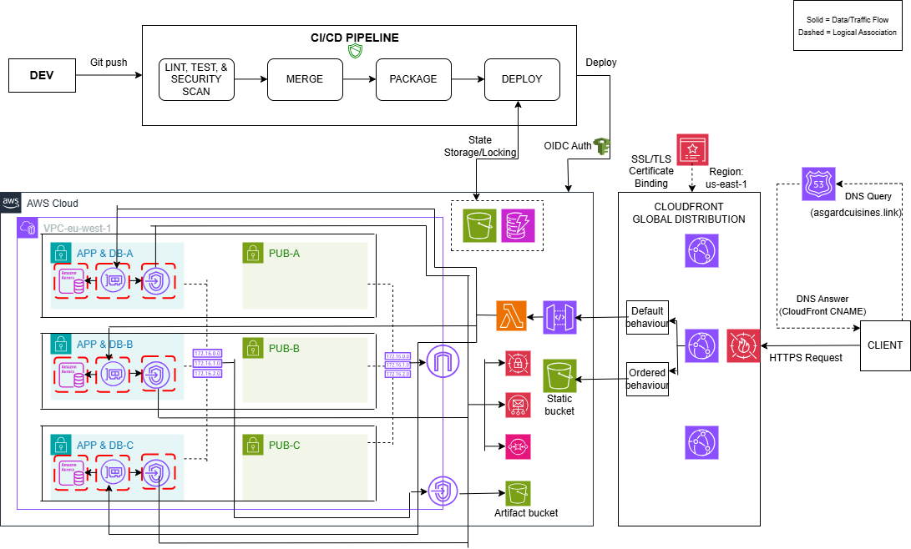

**Production-Grade Serverless Deployment**  
A resilient, secure, production-grade, cloud-native serverless deployment, orchestrated using Terraform and GitHub Actions. This is version 3 of a continuously evolving cloud-native system. Version 1 was the local Docker Compose deployment, and version 2 was the local Kubernetes deployment with Observability.

**Project Scope**  
This project focuses on automated cloud-native serverless application infrastructure deployment on AWS using Terraform and GitHub Actions. It implements enterprise-level zero-trust security via pipeline security scans, OIDC keyless authentication, and cloud environment hardening, and ensures state durability through S3/DynamoDB remote backends. High-level orchestration (EKS) and comprehensive observability are explored in later iterations.

**Installation & Setup**  
Follow these steps to bootstrap the Zero-Trust OIDC identity layer, provision the production-grade serverless application infrastructure, and execute automated database migrations using Terraform and GitHub Actions.  

 1. Prerequisites  
  - AWS Account: An active AWS account with permissions to provision VPCs, Lambda, API Gateway, Aurora Serverless v2, SQS, S3, and IAM roles.  
  - GitHub Account: For hosting the repository and executing the serverless CD deployment workflows.  
  - Terraform CLI: Installed locally to execute the initial local bootstrap phase.    

 2. Repository Setup  
  Clone the repository containing your serverless application and infrastructure configuration to your local machine:

```bash  
git clone https://github.com/ChukaOkeke/restaurant-api-serverless.git
cd restaurant-api-serverless  
```

 3. Local Bootstrap  
  Before GitHub Actions can authenticate to your AWS account without static access keys, you must manually seed the OIDC identity provider and deployment role from your local machine. Navigate to your infrastructure directory, initialize Terraform, and target only the identity components:    

```bash  
cd infrastructure
terraform init

# Target the security module/resources to bootstrap the OIDC trust relationship
terraform apply \
  -target=module.security.aws_iam_openid_connect_provider.github \
  -target=module.security.aws_iam_role.github_actions \
  -target=module.security.aws_iam_role_policy_attachment.terraform_admin
``` 

  Architectural Note: Once this bootstrap command completes successfully, AWS will officially trust your specified GitHub repository, allowing you to hand off all subsequent infrastructure management to the automated CI/CD pipeline.  

 4. GitHub Secrets Configuration  
  This serverless pipeline utilizes keyless federation but requires a baseline environment configuration to target your specific AWS base.  
  - Navigate to your repository on GitHub.  
  - Go to Settings > Secrets and variables > Actions.  
  - Under Repository Secrets, click New repository secret and add the following variables:  
    -> AWS_ACCOUNT_ID: Your 12-digit AWS Account Number (required to dynamically construct the OIDC Role ARN within the workflow runner).  
    -> SNYK_TOKEN: Your Snyk token required to dynamically interact with Snyk for SCA within the workflow runner.  

 5. Deployment Lifecycle  
   With the trust boundary verified and the environment secrets mapped, the infrastructure and code integration and deployment lifecycle is fully automated.  
   - Trigger the Pipeline: Push your codebase changes or infrastructure updates to a feature branch and open a pull request on GitHub:  

```bash  
git add .
git commit -m "feat: deploy production serverless architecture v3"
git push origin feature/modify-lambda-config
``` 
   - Monitor Pipeline Progress: Open the Actions tab in your GitHub repository. The runner will execute the integration phase, and a synchronized two-phase deployment after merging the pull request:  
     -> Phase 1 (Linting, Testing, and Security Scans): Validates the app & infrastructure code syntax, runs pytest, and scans the app & infrastructure code for vulnerabilities and misconfigurations with Bandit, Snyk, and Checkov.   
     -> Phase 2 (Infrastructure & Artifact Staging): Validates code configurations via Pre-Deploy Checkov SAST, provisions core infrastructure, compiles the Django/Python package, and publishes the version-tagged .zip payload directly to S3.  
     -> Phase 3 (Code Injection & Execution): Signals AWS Lambda to pull the new artifact from S3, updates static assets, and kicks off the isolated database runtime hooks.  

 6. Verification & Post-Deployment Database Sync  
   Once the pipeline wraps up Phase 3, GitHub Actions fires an automated Zero-Trust Database Schema Migration Hook to bring the backend online securely.  
   - Automated Migration Hook: The runner safely invokes your Lambda function within its protected private network boundary to synchronize tables using the following automated command:

```bash  
aws lambda invoke \
  --function-name "asgard-api-function" \
  --payload '{"action": "migrate"}' \
  --cli-binary-format raw-in-base64-out \
  migration_output.json
``` 

   - Verify Infrastructure Status: Review the migration_output.json file in your runner or local console to ensure a 200 OK status was returned.  
   - Access the Live API: Query the Route 53-hosted domain name via a web browser to test the serverless api.  

**1. Problem & Non-Functional Requirements (NFRs)**  
 **Problem Statement**  
 The goal was to automate the deployment of a cloud-native serverless architecture on AWS, thereby bypassing manual "click-ops".  

 **Key Features & Non-Functional Requirements**  
 - Resilience: The system should be regionally resilient.  
 - Scalability: The system should cope with unpredictable, bursty load.  
 - Security: The system should have a robust zero-trust security posture.  
 - Cost Optimization: The system should be cost-optimized through right-sizing and cost-effective solutions.  
 - Performance: The system should exhibit low latency.  
 - Maintainability: The codebase should be clean and modular to make it easier to develop and maintain.  
 - Infrastructure as Code (IaC): Reproducible environment provisioning via modular Terraform configurations.  
 - Continuous Integration/Continuous Delivery (CI/CD): Full lifecycle automation (with manual gates) from code push to serverless deployment using GitHub Actions.  
 - Keyless Cloud Authentication: Secure AWS access via OIDC, eliminating the risk of long-lived IAM credentials.  
 - Remote State Management: Guaranteed "Source of Truth" using S3 for state storage and DynamoDB for state locking.  


**2. Architecture Overview**  
The architecture is designed to decouple the deployment engine from the target infrastructure, ensuring a secure and scalable lifecycle.  

 **System Architecture Diagram**  

   


 **Component responsibilities**  
 - CI/CD Block: GitHub Actions executes the path-based CI phase and the unified CD phase.  
 - Route 53: AWS managed DNS service for domain registration and hosting.  
 - CloudFront: AWS Content Delivery Network (CDN) for improving application performance.  
 - Amazon S3: For storing files and data as objects.  
 - API Gateway: For creating and managing APIs to route external traffic to applications.  
 - Lambda: Event-driven serverless compute service.  
 - Aurora Serverless: Fully managed relational database service.  
 - Simple Queue Service (SQS): Message queue for decoupling applications for asynchronous communication.  
 - Secrets Manager: For managing sensitive data like application and database credentials securely.  
 - Simple Email Service (SES): Coordinates the sending and delivery of email notifications.  
 - Virtual Private Cloud (VPC): Logically isolated section/network within the AWS cloud.  
 - Subnets: Logically isolated subdivisions of the VPC.  
 - VPC Endpoints: To enable private VPC resources to reach AWS public zone services without traversing the public internet.  
 - Web Application Firewall (WAF): Application-layer firewall for protecting the application against common web exploits.  
 - AWS Certificate Manager (ACM): For provisioning TLS certificates for HTTP traffic encryption.  
 - Security Groups: To control network traffic to and from resources.   


 **Trust boundaries**  
 **TB1: GitHub Actions -> AWS (OIDC Federation)**: Keyless, short-lived session tokens eliminate static credentials, restricted strictly to the designated repository and production branch.  

 **TB2: Terraform -> Remote State (Encryption & Locking)**: State metadata is isolated in a private, encrypted S3 bucket and protected from concurrent pipeline modification via DynamoDB state locking.  

 **TB3: Client Ingress -> CloudFront, WAF & API Gateway**: Edge-layer rate limiting and OWASP protection filter malicious traffic, while custom header verification drops requests trying to bypass the CDN.  

 **TB4: Lambda Compute -> Aurora Serverless & Secrets**: Compute functions and databases are isolated within a private, multi-AZ VPC, communicating securely via dynamic AWS Secrets Manager injection over private endpoints.  


**3. Key Design Decisions**  
 - Selected Terraform over manual config to ensure the environment is versioned and reproducible.
 - Implemented OIDC to harden security posture by removing the need for long-lived IAM keys.  
 - Integrated SAST and SCA into the automated pipeline to identify and prevent app vulnerabilities and infra misconfigurations.  
 - Utilized GitHub Actions over Jenkins to reduce the operational overhead of the deployment automation.
 - Utilized Lambda and Aurora Serverless v2 as the serverless backend to handle unpredictable, spiky workloads.
 - Implemented an SQS queue to decouple the booking intake from the database write.
 - Deployed a CloudFront distribution to improve the application's performance.
 - Selected VPC Endpoints over NAT Gateway to securely and cost-effectively enable the private VPC resources, like Lambda, to interact with AWS public zone services (Secrets Manager, SQS, SES, S3) without transiting the public internet.
 - Utilized API Gateway as the industry-standard method to route external traffic to Lambda for a serverless architecture.  
 - Leveraged Secrets Manager to securely manage sensitive data like Django secret key and database credentials. 
 - Deployed WAF to protect the application against OWASP Top 10 vulnerabilities.
 - Provisioned a TLS certificate using ACM to encrypt the HTTP traffic. 


**4. Implementation**  
 I utilized Terraform (using Anton Babenko's modular patterns) to manage the provisioning of the AWS serverless infrastructure as code. Used GitHub Actions as the secure CI/CD engine to automate the deployment, integrating SAST & SCA, and utilizing OIDC for secure, keyless authentication to AWS.  


**5. Quality Assurance & Testing**  
 - Infrastructure Validation: Monitored GitHub Actions logs to verify Terraform resource creation and state consistency.
 - Service Verification: Confirmed API availability by querying the hosted domain name associated with the application infrastructure.


**6. Security**  
 - **OIDC Identity Federation**: Used OIDC for short-lived session tokens.
 - **Secrets Management**: Selected AWS Secrets Manager to handle the Django secret key and database credentials securely. Utilized GitHub Secrets to handle Snyk's authentication token securely.
 - **Network Hardening**: Deployed VPC Endpoints for private traffic routing. Restricted Security Group rules to essential ports.
 - **Static Analysis (SAST)**: Performed automated security scans using Bandit and Checkov to identify vulnerabilites and misconfigurations. 
 - **Software Composition Analysis (SCA)**: Integrated Snyk into the automated pipeline to perform security scans on the application dependencies.
 - **Network Traffic Encryption**: Provisioned a TLS certificate with ACM and applied it to the CloudFront distribution to encrypt the HTTP traffic.
 - **Application-Layer Filtering**: Deployed AWS WAF on the CloudFront distribution to protect the application from OWASP Top 10 exploits.

**Tech Stack**  
 - Cloud - **AWS**
 - Infrastructure as Code: **Terraform** 
 - CI/CD: **GitHub Actions**
 - Security: **Bandit, Snyk, Checkov**


**Deep Dive & Demo**  
This repository focuses on automated serverless application infrastructure deployment on AWS using Terraform and GitHub Actions. A detailed breakdown of the architectural decisions, design trade-offs, security boundaries, operational excellence, and lessons learned during the project is documented here on [Beyond the Monolith: Re-Architecting for Resiliency with AWS Lambda, SQS, and Terraform](https://medium.com/@chukaokeke/beyond-the-monolith-re-architecting-for-resiliency-with-aws-lambda-sqs-and-terraform-09abea681869).  
A demo can be found here on [Serverless Deployment demo](https://youtu.be/S7utM4o_dIw).
